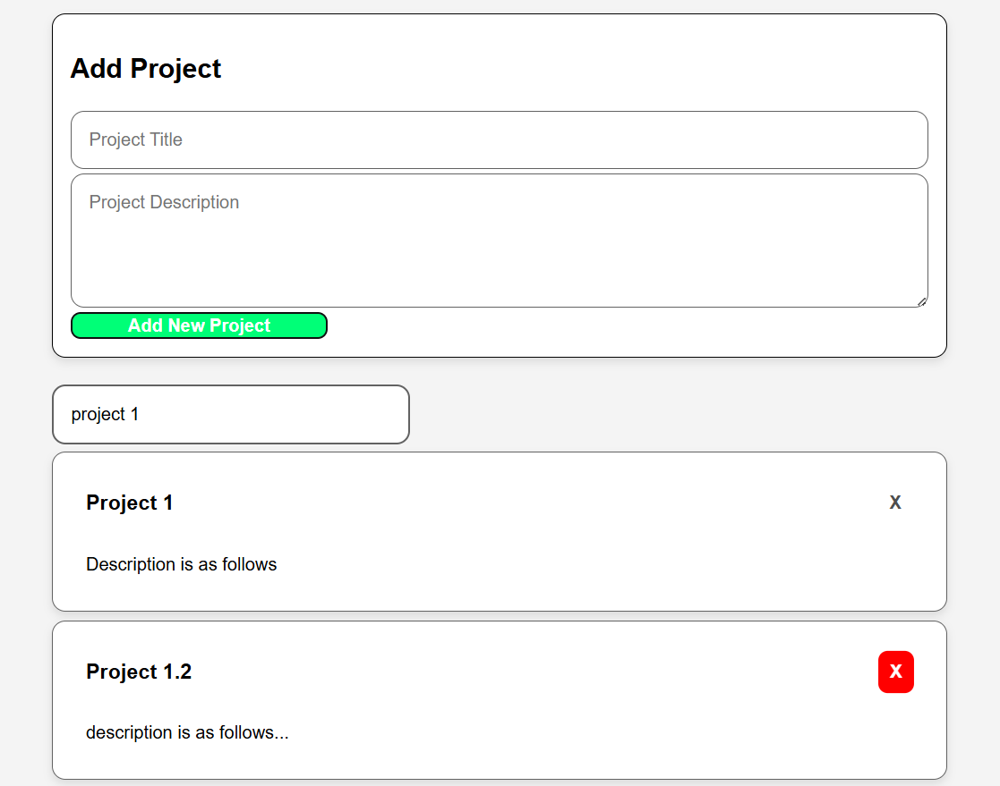

# Personal Project Showcase App

## Overview

The Personal Project Showcase App is a beginner-friendly React application that allows users to
create, search, and manage personal projects through a clean and responsive interface.

Users can:
- Add new projects with a title and description
- Search projects dynamically
- Delete existing projects
- View empty-state messages when no projects exist or no search results are found

This project demonstrates core React concepts including:
- Component-based architecture
- State management with `useState`
- Controlled form inputs
- Passing props between components
- Event handling
- Conditional rendering
- Dynamic rendering with `.map()`
- Basic testing with Vitest and React Testing Library

---

# Features

- Add new projects
- Delete existing projects
- Live project search/filtering
- Empty-state messaging
- Form validation
- Responsive card-based layout
- Custom CSS styling
- Beginner-friendly React architecture

---

# Technologies Used

- React
- Vite
- JavaScript (ES6)
- CSS3
- Vitest
- React Testing Library

---

# Project Structure

```txt
src
├── components
│   ├── Header.jsx
│   ├── ProjectForm.jsx
│   ├── SearchBar.jsx
│   ├── ProjectList.jsx
│   └── ProjectCard.jsx
├── styles
│   └── App.css
├── tests
│   └── App.test.jsx
├── App.jsx
├── index.css
└── main.jsx
```

---

# React Concepts Practiced

## State Management

The application uses React's `useState` hook to manage:
- Project data
- Search input values
- Form input values
- Validation error messages

State was lifted to the nearest shared parent component (`App.jsx`) when needed across multiple components.

---

## Props

Props were used to:
- Pass project data between components
- Trigger project creation and deletion
- Share search state between components

---

## Event Handling

The project demonstrates:
- Form submission handling
- Controlled inputs
- Button click events
- Dynamic filtering during typing

---

## Conditional Rendering

Conditional rendering was implemented for:
- Empty project lists
- No matching search results
- Form validation messages

---

# Accessibility

The application includes:
- Semantic HTML structure
- Accessible form inputs
- Button labels
- Keyboard-friendly form submission
- Clear validation feedback

---

# Screenshot



---

# Running the Project

Install dependencies:

```bash
npm install
```

## Start Development Server

```bash
npm run dev
```

---

# Running Tests

Run the test suite using:

```bash
npm test
```

---

# Lessons Learned

Through this project, I gained experience with:
- Structuring React applications with reusable components
- Managing shared state across components
- Creating controlled forms
- Passing functions and data through props
- Debugging React state and rendering issues
- Building responsive layouts with CSS
- Writing beginner-level frontend tests

---

# Author

Created by Matthew Swanberg as part of a lab for Course 4 Module 8 Summative Lab.